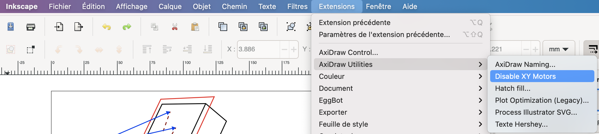
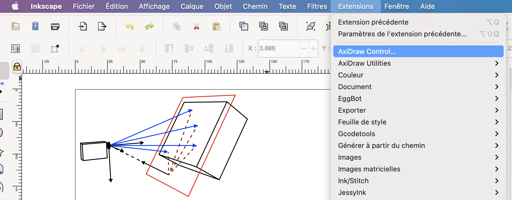
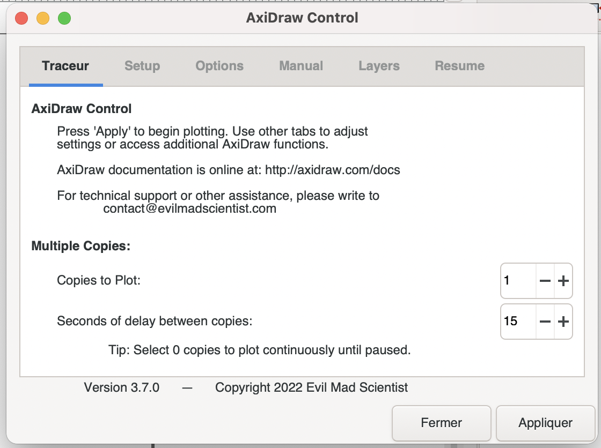
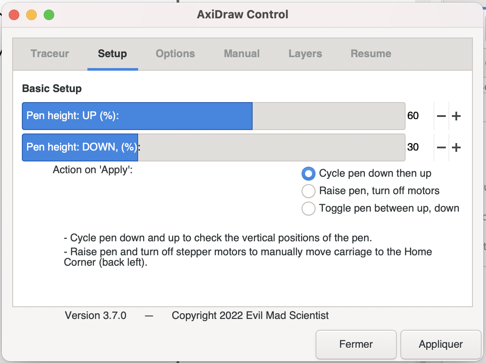
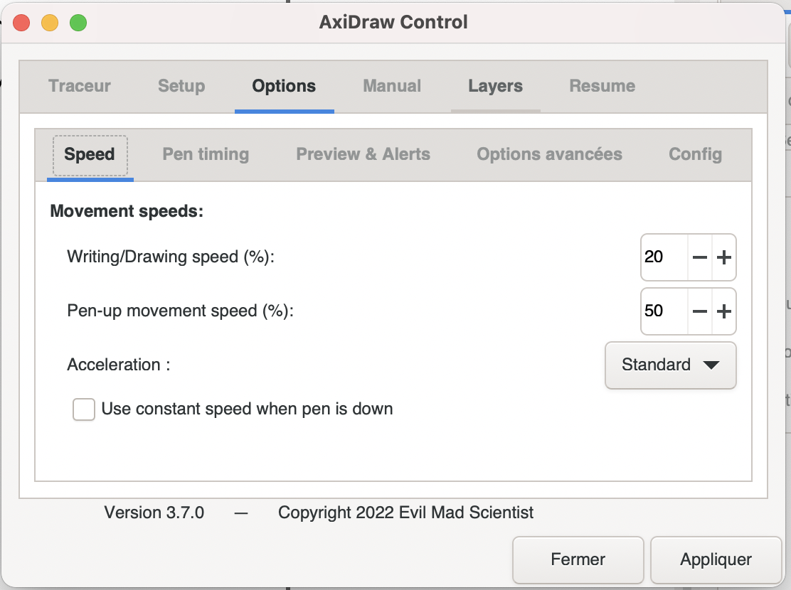
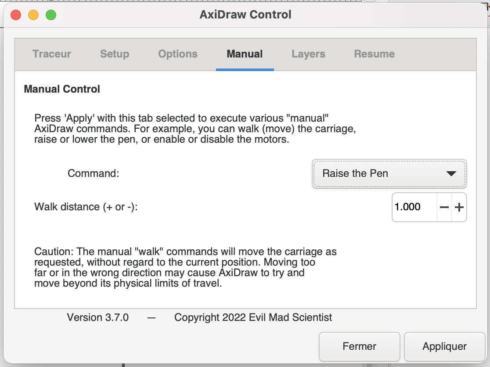
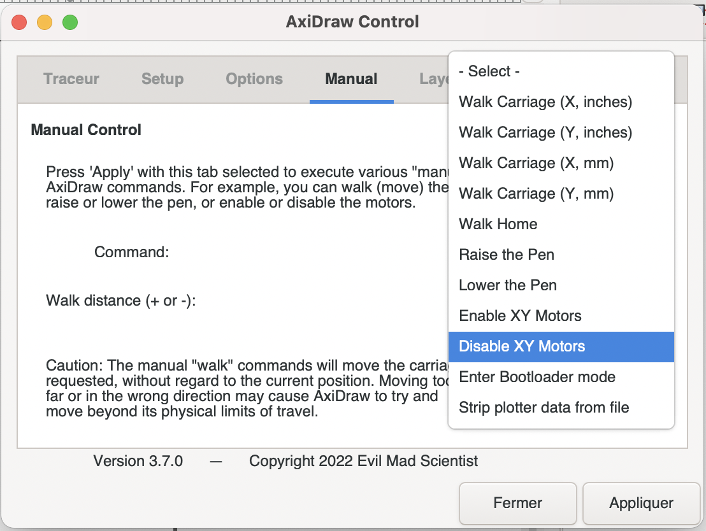
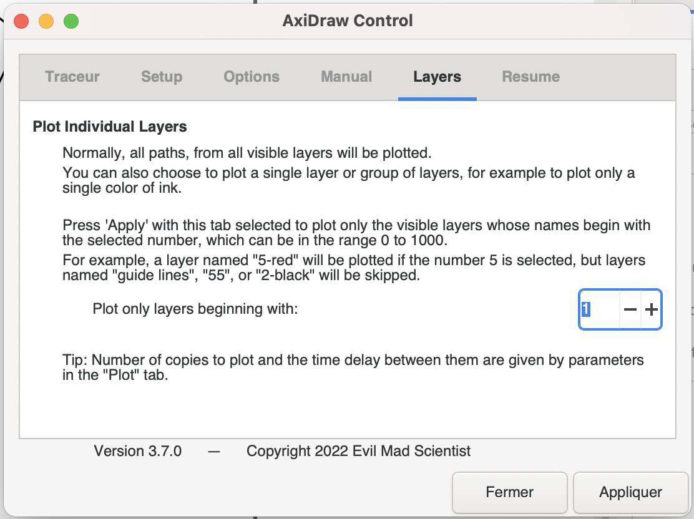
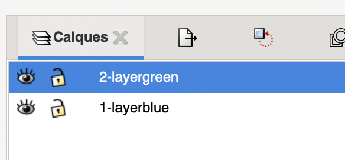

# 🚧🚧 Axidraw_2spi 🚧🚧

**Ou comment utiliser plus ou moins en autonomie l'Axidraw avec Inkscape et un .svg.**

Prérequis : être à l'atelier num, avoir installé [Inkscape](https://inkscape.org) et [l'extension Axidraw](https://wiki.evilmadscientist.com/Axidraw_Software_Installation).

## Mise en place

Brancher l'Axidraw et la connecter en USB à l'ordinateur

Ouvrir son .svg avec Inkscape.

Désactiver les moteurs de l'Axidraw avec `Extensions` > `AxiDraw Utilities` > `Disable XY Motors`.

Une fois que les moteurs sont désactivés, déplacer délicatement le porte-crayon vers le coin en haut à droite, sans forcer.

//photo

Placer la feuille en papier sur la plaque en métal, et la fixer avc les aimants.

//photo

Dans l'onglet `Manual`, soulever le porte-crayon avec l'option `Raise the pen`.

Placer le crayon de son choix dans le porte-crayon, de manière à ce qu'il arrive un peu près 1mm au dessus du papier.

//photo

## Contrôles

Ouvrir le menu Axidraw avec `Extensions` > `AxiDraw Control...`.

-> Dans le menu de contrôle Axidraw, chaque onglet contrôle différentes actions qui peuvent s'appliquer en cliquant sur `Apply`.

Le premier onglet `Plotter`, permet de lancer le plot quand on clique sur `Apply`.

Dans l'onglet `Setup`, on peux choisir la hauteur du crayon dans la position up ou down.

Dans l'onglet `Options`, on peux choisir différents réglages, comme la vitesse.

Dans l'onglet `Manual`, on peux choisir une action physique executée par l'Axidraw quand on clique sur `Apply`.

On peux notamment activer ou désactiver les moteurs. 

Dans l'onglet `Layers`, on peux choisir un calque en particulier à être plotter.

Dans l'onglet `Resume`, on peux choisir une action à faire lorsque qu'on met le plot en pause.

## Plotter le plot

Ouvrir le menu de l'Axidraw, et cliquer sur `Apply` dans l'onglet `Plotter` pour plotter sans différencier les calques. L'Axidraw plottera alors tous les calques visibles.

On peux mettre le plot en pause avec le bouton sur le coté en haut de l'Axidraw.

Pour plot un seul calque à la fois, il faut ajouter un chiffre devant le nom du calque. Par exemple : "1-layerblue", "2-layergreen", etc.

Ensuite, ouvrir l'onglet `Layers`, et choisir quel numéro de calque on veux plotter, puis cliquer sur `Apply`.

# Pour aller plus loin

Le [guide de l'extension Axidraw pour Inkscape](https://www.manualslib.com/manual/1235134/Evil-Mad-Scientist-Axidraw.html).

Une [vidéo qui explique comment utiliser l'extension](https://www.youtube.com/watch?v=r5mhw8-nrg0).
